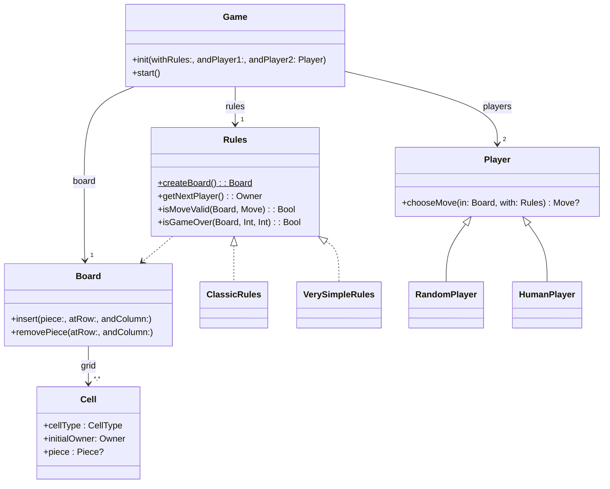

# **Swift_TP---[DouShouQi]**


Sommaire


  
 1. [Introduction](#introduction)
 2. [Diagramme](#structure)
 3. [Lancer le jeu](#lancer)
 4. [Lancer les tests](#tests)
 5. [TP1](#tp1)
 6. [TP2](#tp2)
 7. [TP3](#tp3)
 7. [TP4](#tp4)
 7. [TP5](#tp5)
 7. [TP6](#tp6)
 7. [Auteur](#auteur)

</div>

  
*******

<div  id='introduction'/>

  

## **Introduction au projet** :bulb:

  
Bienvenue dans le passionnant monde de Dou Shou Qi, une application console en cours de développement par Bruno DA COSTA CUNHA. Cette application vise à donner vie à un jeu traditionnel chinois riche en histoire et en stratégie, le Dou Shou Qi.
  
*******

  

<div  id='apropos'/>

## **À propos de Dou Shou Qi** :computer:


**Dou Shou Qi** est un jeu de plateau stratégique dont les origines remontent au Vème siècle. Également connu sous le nom de "Jungle Chess", ce jeu met en scène une bataille animale où chaque pièce représente un animal de la jungle, chacun ayant des capacités et des règles de déplacement spécifiques.

*******

  
<div  id='structure'/>

##**Structure de l'application**

Voici un diagramme de classes volontairement simplifié présentant grossièrement les différents acteurs de l'application que vous devez réaliser :


 
*******

  
<div  id='objectif'/>

## **Objectif du jeu** :computer:
  


Le jeu a plusieurs objectifs possibles pour la victoire :

-   Occuper la tanière de l'adversaire.
-   Manger toutes les pièces de l'adversaire.
-   Empêcher l'adversaire de bouger.
  
  
*******

<div  id='material'/>

## **Matériel** :computer:


Chaque joueur possède huit pièces numérotées, représentant la force de l'animal. Les animaux incluent le Rat, le Chat, le Chien, le Loup, le Léopard, le Tigre, le Lion et l'Éléphant. Le plateau de jeu est une grille à deux dimensions de 10 lignes et 7 colonnes, avec des cases spéciales telles que la Jungle, le Lac, la Tanière et le Piège.


<div  id='lancer'/>

## 🎮 Comment lancer le jeu 
Pour jouer vous devrez cloner ce repos et lancer cette commande dans un terminal :
```sh
swift run
```

<div  id='tests'/>

## 🧪 Tester
Vous pouvez lancer les tests en utilisant :
```sh
swift test
```


<div  id='tp1'/>

*******

## TP1 :zap:

Au cours de la première semaine de développement de Dou Shou Qi, j'ai concentré mes efforts sur la modélisation du jeu. J'ai créé les structures de base nécessaires, telles que les enums pour les types de cellules, les propriétaires, et les animaux. En outre, j'ai mis en place les classes représentant les pièces, les cellules, et le plateau de jeu.

Le package "Model" est désormais fonctionnel, définissant les entités essentielles pour la représentation du jeu. De plus, j'ai élaboré des extensions spécifiques pour les tests en ligne de commande, permettant un affichage visuel attractif en utilisant des emojis.

Le point culminant de la semaine a été la création d'un test en ligne de commande réussi, initialisant un plateau de jeu et l'affichant conformément aux spécifications.


<div  id='tp2'/>

*******

## TP2 :zap:

Au cours de la deuxième semaine, j'ai complété la gestion du plateau de jeu dans l'application Dou Shou Qi. J'ai étendu la classe Board avec des fonctionnalités cruciales, notamment le comptage des pièces, l'insertion et la suppression de pièces, ainsi que la gestion des résultats à l'aide d'enums. J'ai réalisé des tests approfondis dans l'application en lignes de commande, mis en place des tests unitaires pour garantir la fiabilité des fonctions, et ajouté des tests de performance pour évaluer l'efficacité du code.

 *******

 <div  id='tp3'/>

*******

## TP3 :zap:

Pendant la troisième semaine de développement de Dou Shou Qi, l'accent a été mis sur la gestion des règles du jeu. Voici un résumé des tâches accomplies :

### **Gestion des règles du jeu**

Durant cette semaine, nous avons mis en place la gestion des règles du jeu en suivant les spécifications suivantes :

- Création du protocole `Rules` : Nous avons défini un protocole `Rules` pour gérer différentes fonctionnalités telles que la création du plateau de jeu initial, l'ordre de jeu des joueurs, la validation des coups, la vérification de la fin de la partie, etc.
  
- Implémentation des règles simplifiées : Nous avons créé une version simplifiée des règles du jeu qui incluent uniquement les fonctionnalités nécessaires pour jouer avec un plateau initial composé de cases "jungle" et d'une case "tannière" par joueur. Les déplacements et les conditions de victoire ont également été simplifiés.

- Ajout de deux enums : Nous avons ajouté deux enums, `Result` pour indiquer le résultat d'une partie et `WinningReason` pour fournir des précisions lorsqu'il y a un gagnant.

- Définition d'une structure de coup : Nous avons créé une structure `Move` pour représenter un coup, contenant l'auteur du coup et les coordonnées de la cellule de départ et de la cellule d'arrivée.

- Implémentation du protocole `Rules` avec les fonctionnalités requises : Nous avons créé une structure conforme au protocole `Rules` pour respecter les règles du jeu simplifiées. Les fonctionnalités telles que la création du plateau, la vérification des coups valides, la détection de la fin de partie, etc., ont été implémentées.

*******

## TP4 :zap:

<div  id='tp4'/>

*******

### **Gestion des joueurs**

Durant cette semaine, nous avons mis en place la gestion des joueurs en suivant les spécifications suivantes :

- Création de la classe `Player` : Nous avons créé une classe mère `Player` avec les attributs `id` et `name`, ainsi qu'une fonction `chooseMove` qui sera réécrite dans les classes filles. L'initialiseur permet de choisir l'identifiant et le nom du joueur, et peut échouer si l'identifiant n'est pas valide.

- Création de la classe `RandomPlayer` : Nous avons créé une classe dérivant de `Player` qui représente une SA (Stupidité Artificielle) et choisit un coup aléatoire parmi les coups autorisés.

- Création de la classe `HumanPlayer` : Nous avons créé une classe dérivant de `Player` qui représente un joueur humain. La méthode de saisie est injectée via l'initialiseur, permettant ainsi de choisir la méthode de saisie sans être dépendant d'une interface en particulier.

### **Tests unitaires**

Nous avons écrit des tests unitaires pour toutes les classes créées afin de garantir le bon fonctionnement du code. Les tests ont été conçus pour couvrir différents cas de figure et assurer la fiabilité du système.

### **Couverture de tests**

Nous avons cherché à obtenir la meilleure couverture possible en exécutant les tests unitaires et en analysant les résultats pour identifier les éventuelles lacunes dans la couverture de code.

### **Tests en lignes de commande**

Nous avons testé nos classes dans l'application en lignes de commande en affichant le plateau de jeu pour vérifier que les opérations fonctionnent comme attendu. Nous avons vérifié que les joueurs peuvent choisir des coups, que le joueur humain peut saisir ses mouvements, et que le joueur IA choisit des coups aléatoires.

Au terme de cette semaine de travail, la gestion des joueurs est opérationnelle dans l'application Dou Shou Qi, et nous avons obtenu une bonne couverture de tests pour garantir la qualité du code développé.

*******

<div  id='tp5'/>

*******

## TP5 :zap:

### **Gestion des événements**

Nous avons introduit la notion d'événements dans l'application en utilisant un modèle de type "observer". Pour cela, nous avons créé une nouvelle structure `Game` pour agir en tant que médiateur ou façade, faisant le lien entre tous les types précédemment réalisés et l'interface graphique d'affichage de l'état du jeu et de saisie des coups.

Dans cette structure `Game`, nous avons implémenté les fonctionnalités suivantes :

- Ajout d'un mécanisme de listeners pour les événements du jeu.
- Ajout de callbacks pour les événements déclenchés.

### **Notifications à l'interface**

Nous avons utilisé les callbacks pour informer l'interface utilisateur de l'état du jeu. Voici quelques exemples de notifications que nous avons implémentées :

1. Début de la partie :
    - Affichage du plateau de jeu.
    - Affichage du message : 
        ```plaintext
        **************************************
                ==>> GAME STARTS! <<==        
        **************************************
        ```

2. Prochain joueur à jouer :
    - Affichage du plateau de jeu.
    - Affichage du message indiquant au joueur suivant de jouer, par exemple :
        ```plaintext
        **************************************
        Player 1 - Charles Mingus, it's your turn!
        **************************************
        ```

3. État du jeu après chaque coup :
    - Affichage du message "Game is not over yet!" si la partie n'est pas terminée.
    - Affichage du plateau de jeu et du message suivant si la partie est terminée :
        ```plaintext
        **************************************
        Game Over!!!
        and the winner is... player1!
        the opponent's den has been reached.
        **************************************
        ```

4. Autres notifications :
    - Informations sur le coup choisi.
    - Notification si un coup est invalide.
    - Notification si le plateau de jeu a changé.

Grâce à cette gestion d'événements, l'application Dou Shou Qi offre une expérience de jeu interactive et réactive, permettant aux joueurs de rester informés et engagés tout au long de la partie.

*******


<div  id='tp6'/>

*******

## TP6 :zap:

Durant la sixième semaine de développement de Dou Shou Qi, notre objectif principal était d'implémenter la persistance du jeu, permettant aux joueurs de sauvegarder et de reprendre une partie à tout moment. Voici un résumé des tâches accomplies :

### **Implémentation de la persistance**

Nous avons introduit la persistance dans l'application en utilisant le protocole Codable pour sérialiser et désérialiser les différents types de données du jeu. Voici les étapes que nous avons suivies :

1. **Persistance des types simples :** Nous avons commencé par réaliser la persistance (lecture et écriture) des types simples tels que Animal, Owner et CellType. Nous avons testé ces fonctionnalités dans des applications en lignes de commande pour nous assurer de leur bon fonctionnement.

2. **Persistance des types intermédiaires :** Ensuite, nous avons poursuivi avec des types un peu plus complexes comme Piece, Move et Cell, en implémentant leur conformité au protocole Codable et en les testant dans l'application en lignes de commande.

3. **Persistance des types complexes :** Nous avons ensuite abordé la persistance du type complexe Board, en prenant en compte sa structure de grille et ses cellules.

4. **Persistance des règles et des joueurs :** Les difficultés ont commencé réellement avec la persistance des types Rules et Player, en particulier pour gérer les différents types fils existants et leurs données associées.

5. **Persistance du jeu :** Enfin, nous avons terminé avec l'implémentation de la persistance pour le type Game, en ajoutant un callback asynchrone pour lancer l'enregistrement à chaque étape importante du jeu.

### **Options de chargement au lancement du jeu**

Au lancement du test en lignes de commande, nous avons offert aux joueurs les options suivantes :

- Lancer une nouvelle partie.
- Reprendre la dernière partie enregistrée.

Cela offre une expérience utilisateur flexible et permet aux joueurs de reprendre une partie là où ils l'ont laissée.

### **Gestion des packages**

Pour répondre aux recommandations et aux challenges, nous avons séparé l'intégralité de la persistance (y compris la conformité au protocole Codable) dans un autre package distinct de Model. Cela garantit une structure modulaire et maintenable de l'application.

Grâce à l'implémentation de la persistance, l'application Dou Shou Qi offre désormais aux joueurs la possibilité de sauvegarder et de reprendre leurs parties à tout moment, ajoutant ainsi une dimension supplémentaire à l'expérience de jeu.

*******

<div  id='auteur'/>

## Auteur :busts_in_silhouette:

BUT Informatique - Clermont Ferrand - 2023-2024
Étudiant 3ème année - Filière Mobile :
   
`DA COSTA CUNHA Bruno`

*******