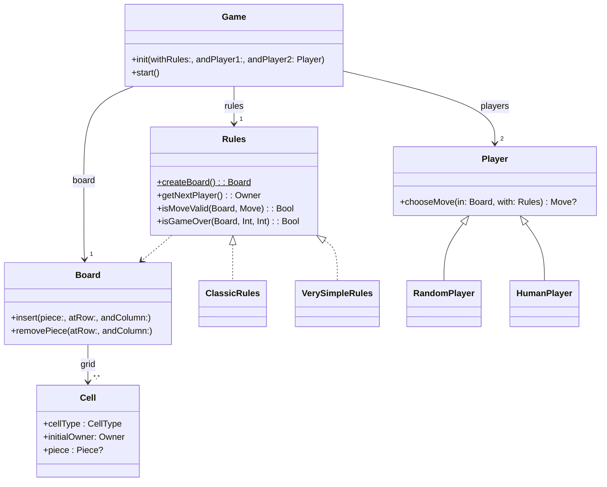

# **Swift_TP---[DouShouQi]**


Sommaire


  
 1. [Introduction](#introduction)
 1. [Diagramme](#structure)
 2. [Lancer le jeu](#lancer)
 3. [Lancer les tests](#tests)
 4. [TP1](#tp1)
 5. [TP2](#tp2)
 6. [TP3](#tp3)
 7. [Auteur](#auteur)

</div>

  
  

*******

<div  id='introduction'/>

  

## **Introduction au projet** :bulb:

  
Bienvenue dans le passionnant monde de Dou Shou Qi, une application console en cours de développement par Bruno DA COSTA CUNHA. Cette application vise à donner vie à un jeu traditionnel chinois riche en histoire et en stratégie, le Dou Shou Qi.
  
*******

  

<div  id='apropos'/>

## **À propos de Dou Shou Qi** :computer:


**Dou Shou Qi** est un jeu de plateau stratégique dont les origines remontent au Vème siècle. Également connu sous le nom de "Jungle Chess", ce jeu met en scène une bataille animale où chaque pièce représente un animal de la jungle, chacun ayant des capacités et des règles de déplacement spécifiques.

*******

  
<div  id='structure'/>

##**Structure de l'application**

Voici un diagramme de classes volontairement simplifié présentant grossièrement les différents acteurs de l'application que vous devez réaliser :


 
*******

  
<div  id='objectif'/>

## **Objectif du jeu** :computer:
  


Le jeu a plusieurs objectifs possibles pour la victoire :

-   Occuper la tanière de l'adversaire.
-   Manger toutes les pièces de l'adversaire.
-   Empêcher l'adversaire de bouger.
  
  
*******

<div  id='material'/>

## **Matériel** :computer:


Chaque joueur possède huit pièces numérotées, représentant la force de l'animal. Les animaux incluent le Rat, le Chat, le Chien, le Loup, le Léopard, le Tigre, le Lion et l'Éléphant. Le plateau de jeu est une grille à deux dimensions de 10 lignes et 7 colonnes, avec des cases spéciales telles que la Jungle, le Lac, la Tanière et le Piège.


<div  id='lancer'/>

## 🎮 Comment lancer le jeu 
Pour jouer vous devrez cloner ce repos et lancer cette commande dans un terminal :
```sh
swift run
```

<div  id='tests'/>

## 🧪 Tester
Vous pouvez lancer les tests en utilisant :
```sh
swift test
```


<div  id='tp1'/>

*******

## TP1 :zap:

Au cours de la première semaine de développement de Dou Shou Qi, j'ai concentré mes efforts sur la modélisation du jeu. J'ai créé les structures de base nécessaires, telles que les enums pour les types de cellules, les propriétaires, et les animaux. En outre, j'ai mis en place les classes représentant les pièces, les cellules, et le plateau de jeu.

Le package "Model" est désormais fonctionnel, définissant les entités essentielles pour la représentation du jeu. De plus, j'ai élaboré des extensions spécifiques pour les tests en ligne de commande, permettant un affichage visuel attractif en utilisant des emojis.

Le point culminant de la semaine a été la création d'un test en ligne de commande réussi, initialisant un plateau de jeu et l'affichant conformément aux spécifications.


<div  id='tp2'/>

*******

## TP2 :zap:

Au cours de la deuxième semaine, j'ai complété la gestion du plateau de jeu dans l'application Dou Shou Qi. J'ai étendu la classe Board avec des fonctionnalités cruciales, notamment le comptage des pièces, l'insertion et la suppression de pièces, ainsi que la gestion des résultats à l'aide d'enums. J'ai réalisé des tests approfondis dans l'application en lignes de commande, mis en place des tests unitaires pour garantir la fiabilité des fonctions, et ajouté des tests de performance pour évaluer l'efficacité du code.

 *******


 <div  id='tp3'/>

*******

## TP3 :zap:

à faire

 *******

<div  id='auteur'/>


## Auteur :busts_in_silhouette:

BUT Informatique - Clermont Ferrand - 2023-2024
Étudiant 3ème année - Filière Mobile :
   
`DA COSTA CUNHA Bruno`

*******